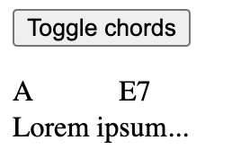

# Chords
_A WordPress plugin to display chords correctly right where you want using shortcodes_

**The chords will be shown exactly where you want on all devices regardless of the font!**

## Usage:
- `[toggleChords]Toggle chords[/toggleChords]` display a button to show or hide chords.  
- `[chords]...[/chords]` delimit the lyrics of the song to which you want to put chords.  
- `{A}` is a chord, you must put it just before the letter you want it to be placed on.

### Example
```
[toggleChords]Toggle chords[/toggleChords]
[chords]
{A}Lorem ip{E7}sum...
[/chords]
```

#### Result

